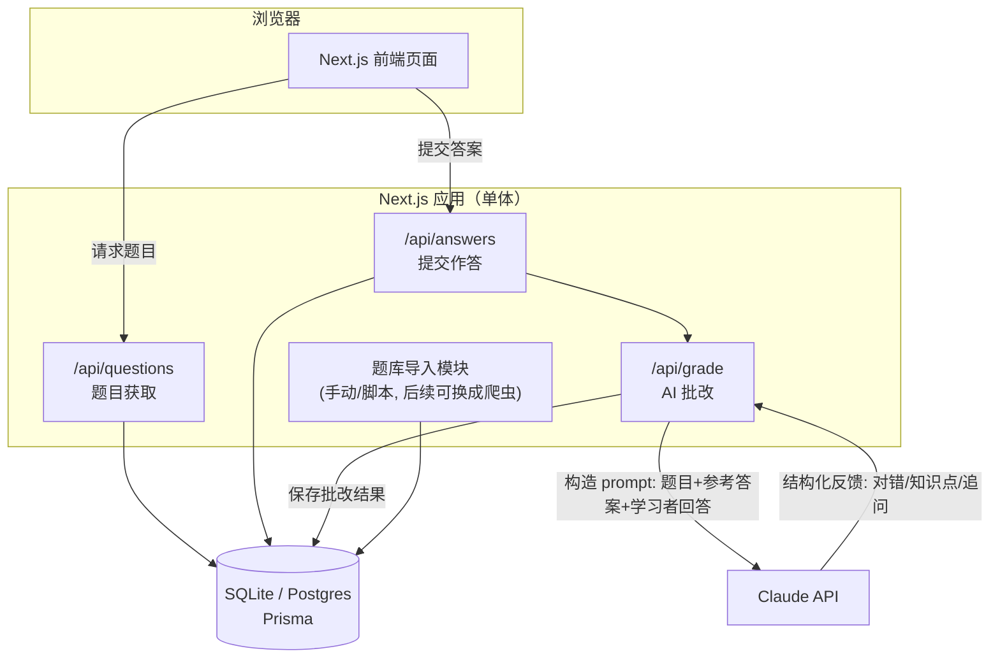
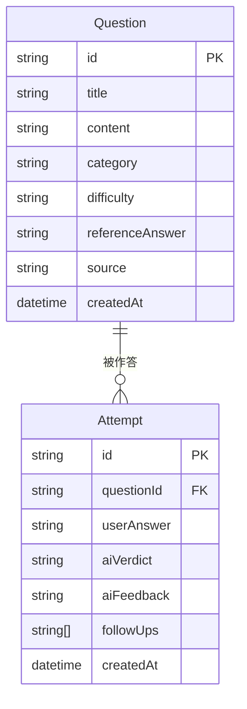

# MLE AI Booster

一个面向 AI/ML 工程师（MLE）岗位面试的刷题与 AI 陪练工具：题库来自网络爬取/整理，学习者作答后由 AI 给出批改、纠错和追问，帮助巩固面试知识点。

> 当前阶段：主界面 dashboard 已完成（本地假数据，未接数据库与 AI）。下一步是阶段 1 的三个模块页与 AI 批改闭环。设计会随实际开发迭代更新。

## 1. 产品定位与 MVP 范围

- **目标用户**：个人 / 小范围使用（自用或分享给几个朋友），暂不做多租户、注册登录、计费等面向公开产品的能力。先把核心学习闭环做扎实，后续再评估是否要往"产品"方向扩展。
- **核心闭环**：
  1. 系统展示一道面试题（概念题 / 场景题 / 追问式题目）
  2. 学习者输入文字回答
  3. AI 对回答进行批改：指出对错、遗漏点、给出参考答案、酌情追问
  4. 学习者可以查看历史记录，追踪哪些知识点掌握得不好
- **暂不做**（留到后续阶段）：
  - 用户账号体系 / 多用户数据隔离
  - 自动化爬虫调度（题库先靠手动导入 / 人工整理的种子数据，爬虫模块预留可插拔接口，具体实现后续再设计）
  - 计费、配额限制
  - 移动端 App（先做响应式 Web）

## 2. 技术栈选型

选择 **全栈 Next.js（TypeScript）**，前后端在同一个仓库、同一套语言里完成，降低个人项目的维护成本：

| 层 | 选型 | 理由 |
|---|---|---|
| 前端 | Next.js (App Router) + React + TypeScript | SSR/CSR 混合，页面路由和 API 路由统一 |
| UI | Tailwind CSS + shadcn/ui | 组件开箱即用，样式一致性好，个人项目开发效率高 |
| 后端逻辑 | Next.js Route Handlers (`app/api/**`) | 不用单独起一个后端服务，前后端共享类型定义 |
| 数据库 | SQLite（本地开发）→ Postgres（未来部署时可平滑迁移） | 本地开发零配置；ORM 屏蔽差异，迁移成本低 |
| ORM | Prisma | schema 即文档，migration 管理清晰，TS 类型自动生成 |
| AI 能力 | Claude API（Anthropic SDK） | 用于题目批改、追问生成；后续可扩展支持切换模型 |
| 题库来源 | 手动导入 / 种子数据（JSON/CSV）+ 预留爬虫接口 | 当前不设计具体爬虫，只约定"题目导入"的数据契约，后续可插拔实现 |
| 部署 | 暂不考虑，先保证本地 `npm run dev` 跑通 | 架构上不锁死平台，Next.js 对 Vercel / 自建 Docker 都友好 |

## 3. 系统架构



**说明**：
- 目前是单体应用（Next.js 一个进程），没有拆分独立的爬虫服务/微服务，避免个人项目过度设计。
- 题库导入模块（`Ingest`）只定义数据契约（见下方数据模型），具体是"手动整理 JSON 导入"还是"写爬虫脚本"是后续可替换的实现细节。
- AI 批改被抽成独立的 API 层（`/api/grade`），方便以后替换/对比不同模型，或加缓存、限流。

## 4. 数据模型（初版）



- `Question`：题目本体，`category`（如 ML 基础 / 系统设计 / coding / behavioral）、`difficulty`、`referenceAnswer`（用于给 AI 做批改参照）、`source`（题目来源，便于以后追溯是哪次导入/哪个渠道）。
- `Attempt`：每一次作答记录，包含 AI 的判定（`aiVerdict`：正确/部分正确/错误）、详细反馈文本、以及可能的追问列表，用于后续做"薄弱知识点"统计。
- 当前不设计 `User` 表；如果后续要支持多用户，只需新增 `User` 并给 `Attempt` 加 `userId` 外键，不影响现有结构。

## 5. 目录结构

脚手架用的是 `--no-src-dir`，代码直接放在仓库根目录，不套 `src/`（Next.js 官方模板默认如此，没必要多一层）。

```
mle-ai-booster/
├── app/
│   ├── layout.tsx             # 根布局：字体、metadata
│   ├── globals.css            # 设计令牌（品牌红蓝 / 图表标记色 / 状态色）+ Tailwind
│   ├── page.tsx               # 主界面 dashboard
│   ├── books/                 # MLE 题本（阶段 1）
│   ├── wrong-answers/         # 错题库（阶段 1）
│   ├── classifier/            # MLE 题库分类器（阶段 1）
│   └── api/                   # 阶段 1 新增：questions / answers / grade
├── components/                # 展示组件，全部为 server component
│   ├── BrandMark.tsx          # blaugrana 竖条纹品牌标记
│   ├── ProgressRing.tsx       # 今日计划进度环（meter）
│   ├── StatTile.tsx           # KPI 小卡
│   ├── ModuleCard.tsx         # 三大入口模块卡
│   ├── MasteryBars.tsx        # 分类掌握度（单色相 meter）
│   ├── WeeklyBars.tsx         # 近 7 天刷题量（单序列柱状图）
│   ├── VerdictPill.tsx        # AI 判定状态标签
│   └── ComingSoon.tsx         # 未完成模块的占位页
├── lib/
│   ├── types.ts               # 领域类型，字段与第 4 节数据模型对齐
│   ├── mock-data.ts           # 本地假数据，阶段 1 换成 Prisma 查询
│   ├── db.ts                  # 阶段 1 新增：Prisma client（懒加载）
│   └── llm.ts                 # 阶段 1 新增：Claude API 封装
├── prisma/                    # 阶段 1 新增
│   └── schema.prisma
└── data/                      # 阶段 1 新增
    └── seed-questions.json
```

### 界面设计约定

- **品牌配色红蓝**：巴萨 blaugrana（`#004D98` / `#A50044`）× 哈佛 crimson（`#A51C30`）× 浙大求是蓝（`#003F88`）。
- **模块划分参考百词斩**（题本≈单词书、错题库≈错词本、分类器≈分类浏览、今日计划≈打卡），但视觉设计不模仿。
- **两组颜色不要混用**，见 `globals.css` 顶部注释：
  - `--brand-*` 用于 UI chrome（导航、按钮、装饰条），不受图表亮度带约束；
  - `--mark-*` 用于图表标记，已通过 CVD / 亮度带 / 对比度校验（light 蓝 `#2f7fd6` vs 红 `#A50044` 的 CVD ΔE 22.3；dark 蓝 `#4a94e8` vs 红 `#e0578f` 的 ΔE 14.7）。**改动标记色前必须重跑校验**，不要凭肉眼判断。
- **状态色固定不随品牌走**（good/warning/critical），且始终「图标 + 文字」成对出现，不靠颜色单独表意。
- 图表形式按数据职责选：单个当前值用 KPI 小卡而非单柱图；比值对上限用 meter（同色系轨道 + 填充）而非饼图；同一指标跨分类比较用单一色相，不用分类色板。

## 6. 核心流程：作答 → AI 批改

1. 前端从 `/api/questions` 拉一道题（可按 `category`/`difficulty` 筛选，或随机）。
2. 学习者提交回答 → `POST /api/answers` 落库为一条 `Attempt`（此时 `aiVerdict` 为空）。
3. 服务端调用 `/api/grade`（或直接在 `answers` handler 里调用），组装 prompt：
   - 题目 + 参考答案 + 学习者回答 → 要求模型输出结构化 JSON（判定、缺漏点、纠正说明、1-2 个追问）。
   - 用结构化输出（tool use / JSON schema）保证前端能稳定渲染，而不是解析自由文本。
4. 批改结果写回 `Attempt`，前端展示反馈；学习者可选择继续回答追问，或进入下一题。
5. 历史记录页面按 `category` 聚合正确率，帮助学习者定位薄弱环节。

## 7. 题库来源（当前阶段）

- 先手动整理一批种子题目（`data/seed-questions.json`），通过一个简单的 seed 脚本导入数据库，跑通整个学习闭环。
- 预留 `src/lib/ingest/` 目录和统一的"导入一批 Question"函数签名，后续无论是写爬虫、调用第三方题库 API，还是接入 RSS/社区帖子抓取，都只需实现同一个接口，不影响上层。
- 爬虫的具体技术方案（目标网站、反爬策略、更新频率、去重）留到确定数据源之后再设计，避免过早决策。

## 8. 路线图

- **阶段 0（已完成）**：架构设计、README、技术选型确认、CI/CD、主界面 dashboard（假数据）。
- **阶段 1（当前）**：跑通最小闭环 —— 种子题库 + 题本/错题库/分类器三个页面 + 答题页 + AI 批改，单用户、本地运行。
- **阶段 2**：历史记录 / 薄弱知识点统计、更好的 prompt 设计、追问式多轮对话。
- **阶段 3（按需）**：题库自动化更新（爬虫/定时任务）、部署上线。
- **阶段 4（按需，视是否要面向他人开放）**：用户账号体系、多用户数据隔离。

## 9. 本地开发

Node 版本要求 **24.x**（见 `.nvmrc` 与 `package.json` 的 `engines.node`）。用 nvm 的话：

```bash
nvm use          # 读取 .nvmrc
npm install
npm run dev
```

三个校验命令和 CI 里跑的完全一致，提交前本地先过一遍：

```bash
npm run lint
npm run typecheck
npm run build
```

Prisma / 数据库相关命令会在阶段 1 接入 Prisma 后补充；具体的环境变量（如 `ANTHROPIC_API_KEY`）也会在那时补充到本文档。

## 10. CI/CD

### CI（已配置并跑通）

`.github/workflows/ci.yml`，在 push / PR 到 `main` 时触发，两个并行 job：

| Job | 内容 | 作用 |
|---|---|---|
| `lint / typecheck / build` | `npm ci` → `npm run lint` → `npm run typecheck` → `npm run build` | 保证 `main` 始终可构建 |
| `dependency audit` | `npm audit --audit-level=high` | high 及以上漏洞直接红 |

几个刻意的设计：

- **Node 版本单一来源**：CI 用 `node-version-file: .nvmrc`，本地 `nvm use` 读同一个文件，Vercel 侧读 `package.json` 的 `engines.node`（Vercel 不读 `.nvmrc`）。三处都是 **24.x**。
  - 注意：Vercel 将于 **2026-10-01 弃用 Node 20**，上游 Node 20 已在 2026-04 EOL，所以这里不用 20。
- **`concurrency` + `cancel-in-progress`**：同一分支连续 push 时取消旧 run，省 Actions 额度。
- **`permissions: contents: read`**：最小权限，CI 只需要读代码。
- **缓存两层**：`setup-node` 的 npm 缓存 + `.next/cache`（Next.js 增量构建缓存）。
- **audit 单独成 job**：红的时候一眼能区分「代码问题」还是「依赖漏洞」。如果某个传递依赖长期没有修复版导致噪音，在该 step 上加 `continue-on-error: true`，不要放宽 `--audit-level`。

### 建议开启分支保护（需要你在网页上操作）

CI 现在会跑，但不会阻止把红的代码合进 `main`。GitHub → 仓库 **Settings → Rules → Rulesets → New branch ruleset**（或旧版 Settings → Branches）：

1. Target branches 选 `main`。
2. 勾 **Require status checks to pass**，把 `lint / typecheck / build` 和 `dependency audit` 加进去。
3. 勾 **Require a pull request before merging**（个人项目可不勾，想直接 push main 就留空）。

### 运行形态：本地带数据库，云端不带

当前是自研自用阶段，刻意做成**两种形态共用一份代码**，云端不连任何数据库：

| | 本地 `localhost` | 云端（Vercel） |
|---|---|---|
| 数据库 | SQLite 文件，完整读写 | **不连库** |
| 题目来源 | 数据库（由种子数据导入） | 直接读打包进 bundle 的 `data/seed-questions.json` |
| 作答记录 | 落库为 `Attempt`，可查历史 | 不落库，仅存浏览器 `localStorage`，刷新站点即失 |
| 历史统计 / 薄弱知识点 | 有 | 无（依赖 `Attempt` 表） |
| AI 批改 | 有 | 有（走 Claude API，与数据库无关） |
| 成本 | $0 | $0 |

切换开关就是 `DATABASE_URL` 这一个环境变量：**存在则走数据库，不存在则降级到只读种子数据 + localStorage。** 云端不配这个变量即可。

这么做的好处：云端始终有一个能点开演示的地址，但零数据库成本、零数据合规负担（不存任何他人数据）；等真要给别人用、需要历史记录了，只要在 Vercel 加上 `DATABASE_URL`（比如 Neon 免费版）就自动升级为完整形态，代码不用改。

**由此产生三条硬约束，写代码时必须守住（否则 CI 或 Vercel 构建会红）：**

1. **构建期绝不能连数据库。** 需要数据库的页面必须标 `export const dynamic = 'force-dynamic'`，不要让它进静态预渲染。
2. **`prisma generate` 可以放进构建（它不连库）；`prisma migrate deploy` 绝不能放进 Vercel 构建。** migration 只在本地对本地库执行。
3. **Prisma client 必须懒加载**（用到时才 `new PrismaClient()`），不能在模块顶层就建连接 —— 否则云端一 import 就炸。

> CI 天然就是这条架构的守卫：CI 里**没有** `DATABASE_URL`，却要跑 `npm run build`。哪天有人不小心写了构建期的数据库访问，CI 立刻变红，不用等部署到 Vercel 才发现。这个保护是免费的，不需要额外配置。

### 成本：当前全链路 $0（均已核实）

| 项 | 免费额度 | 说明 |
|---|---|---|
| GitHub Actions | **public 仓库无限分钟**；private 为 2000 分钟/月 | 单次 CI 约 2 分钟，即便转 private 也远用不完 |
| Vercel Hobby | 免费，无需信用卡；100 次部署/天 | **限非商业、个人用途**（fair use）。将来要商业化需升 Pro（$20/月/席） |
| 数据库 | **$0，因为云端不连库** | 需要时再接 Neon 免费版：永久免费、不要信用卡、0.5 GB/项目、100 CU-hours/月、闲置自动 scale-to-zero |
| Claude API | 无免费额度 | 唯一真实支出，按 token 计费，与部署方案无关 |

注意：`ANTHROPIC_API_KEY` 一旦配到公开可访问的云端部署上，任何人都能通过页面消耗你的 API 额度。自用阶段建议在 Vercel 打开 **Settings → Deployment Protection → Vercel Authentication**（Hobby 计划可用），这样只有登录你 Vercel 账号的人能访问该部署。

### CD：部署到 Vercel（走官方 Git 集成，仓库内无需配置）

不需要额外写 GitHub Actions —— Vercel 的 Git 集成本身就是 CD：

1. 在 [vercel.com](https://vercel.com) 用 GitHub 账号登录，**Add New Project**，选择 `Raventhatfly/MLE-AI-Booster`。
2. Framework Preset 会自动识别为 Next.js，默认配置直接可用；Node.js Version 会被 `engines.node`（`24.x`）覆盖，无需手动改。
3. 连接后自动生效：push 到 `main` → 生产部署；其他分支 / PR → 独立的 Preview 部署链接。
4. 环境变量在 **Settings → Environment Variables** 配，**不要提交到仓库**（`.gitignore` 已排除 `.env*`）：
   - `ANTHROPIC_API_KEY` —— Claude API 密钥（阶段 1 需要）
   - `DATABASE_URL` —— **云端刻意留空**，见上方「运行形态」。将来要完整形态时才填
5. 建议同时打开 **Deployment Protection → Vercel Authentication**，见上方成本一节的说明。
6. 这一步需要你自己的 Vercel 账号授权，无法代为完成。

> Vercel 的构建独立于 GitHub Actions：CI 红了 Vercel 照样会部署。如果要「CI 通过才允许部署」，得配上面的分支保护 + 只从 PR 合并到 `main`。
