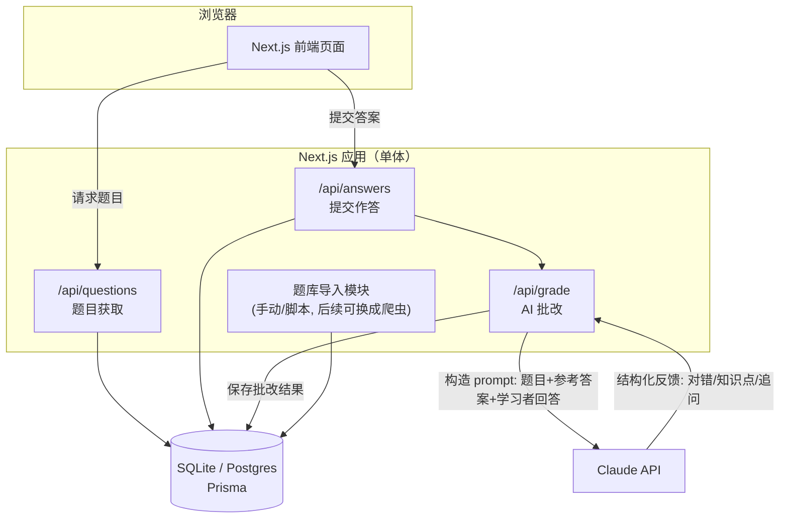
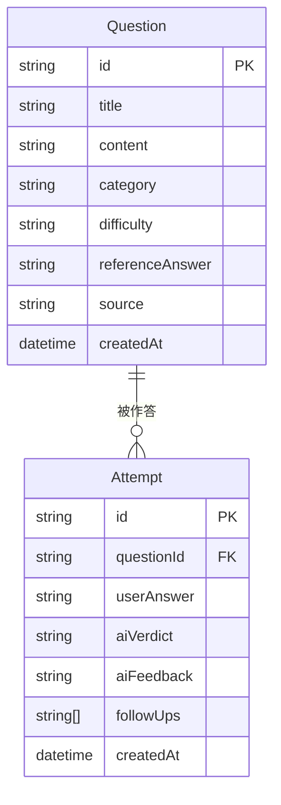

# MLE AI Booster

一个面向 AI/ML 工程师（MLE）岗位面试的刷题与 AI 陪练工具：题库来自网络爬取/整理，学习者作答后由 AI 给出批改、纠错和追问，帮助巩固面试知识点。

> 当前阶段：架构设计与规划。尚未开始编码，本 README 记录整体设计思路，作为后续开发的依据。设计会随实际开发迭代更新。

## 1. 产品定位与 MVP 范围

- **目标用户**：个人 / 小范围使用（自用或分享给几个朋友），暂不做多租户、注册登录、计费等面向公开产品的能力。先把核心学习闭环做扎实，后续再评估是否要往"产品"方向扩展。
- **核心闭环**：
  1. 系统展示一道面试题（概念题 / 场景题 / 追问式题目）
  2. 学习者输入文字回答
  3. AI 对回答进行批改：指出对错、遗漏点、给出参考答案、酌情追问
  4. 学习者可以查看历史记录，追踪哪些知识点掌握得不好
- **暂不做**（留到后续阶段）：
  - 用户账号体系 / 多用户数据隔离
  - 自动化爬虫调度（题库先靠手动导入 / 人工整理的种子数据，爬虫模块预留可插拔接口，具体实现后续再设计）
  - 计费、配额限制
  - 移动端 App（先做响应式 Web）

## 2. 技术栈选型

选择 **全栈 Next.js（TypeScript）**，前后端在同一个仓库、同一套语言里完成，降低个人项目的维护成本：

| 层 | 选型 | 理由 |
|---|---|---|
| 前端 | Next.js (App Router) + React + TypeScript | SSR/CSR 混合，页面路由和 API 路由统一 |
| UI | Tailwind CSS + shadcn/ui | 组件开箱即用，样式一致性好，个人项目开发效率高 |
| 后端逻辑 | Next.js Route Handlers (`app/api/**`) | 不用单独起一个后端服务，前后端共享类型定义 |
| 数据库 | SQLite（本地开发）→ Postgres（未来部署时可平滑迁移） | 本地开发零配置；ORM 屏蔽差异，迁移成本低 |
| ORM | Prisma | schema 即文档，migration 管理清晰，TS 类型自动生成 |
| AI 能力 | Claude API（Anthropic SDK） | 用于题目批改、追问生成；后续可扩展支持切换模型 |
| 题库来源 | 手动导入 / 种子数据（JSON/CSV）+ 预留爬虫接口 | 当前不设计具体爬虫，只约定"题目导入"的数据契约，后续可插拔实现 |
| 部署 | 暂不考虑，先保证本地 `npm run dev` 跑通 | 架构上不锁死平台，Next.js 对 Vercel / 自建 Docker 都友好 |

## 3. 系统架构



**说明**：
- 目前是单体应用（Next.js 一个进程），没有拆分独立的爬虫服务/微服务，避免个人项目过度设计。
- 题库导入模块（`Ingest`）只定义数据契约（见下方数据模型），具体是"手动整理 JSON 导入"还是"写爬虫脚本"是后续可替换的实现细节。
- AI 批改被抽成独立的 API 层（`/api/grade`），方便以后替换/对比不同模型，或加缓存、限流。

## 4. 数据模型（初版）



- `Question`：题目本体，`category`（如 ML 基础 / 系统设计 / coding / behavioral）、`difficulty`、`referenceAnswer`（用于给 AI 做批改参照）、`source`（题目来源，便于以后追溯是哪次导入/哪个渠道）。
- `Attempt`：每一次作答记录，包含 AI 的判定（`aiVerdict`：正确/部分正确/错误）、详细反馈文本、以及可能的追问列表，用于后续做"薄弱知识点"统计。
- 当前不设计 `User` 表；如果后续要支持多用户，只需新增 `User` 并给 `Attempt` 加 `userId` 外键，不影响现有结构。

## 5. 目录结构（规划）

```
mle-ai-booster/
├── prisma/
│   └── schema.prisma
├── src/
│   ├── app/
│   │   ├── (site)/            # 页面：题目列表、答题页、历史记录
│   │   └── api/
│   │       ├── questions/
│   │       ├── answers/
│   │       └── grade/
│   ├── lib/
│   │   ├── db.ts              # Prisma client 单例
│   │   ├── llm.ts             # Claude API 封装
│   │   └── ingest/            # 题库导入：预留目录，先放手动导入脚本
│   └── components/
├── data/
│   └── seed-questions.json    # 初始种子题库
└── README.md
```

## 6. 核心流程：作答 → AI 批改

1. 前端从 `/api/questions` 拉一道题（可按 `category`/`difficulty` 筛选，或随机）。
2. 学习者提交回答 → `POST /api/answers` 落库为一条 `Attempt`（此时 `aiVerdict` 为空）。
3. 服务端调用 `/api/grade`（或直接在 `answers` handler 里调用），组装 prompt：
   - 题目 + 参考答案 + 学习者回答 → 要求模型输出结构化 JSON（判定、缺漏点、纠正说明、1-2 个追问）。
   - 用结构化输出（tool use / JSON schema）保证前端能稳定渲染，而不是解析自由文本。
4. 批改结果写回 `Attempt`，前端展示反馈；学习者可选择继续回答追问，或进入下一题。
5. 历史记录页面按 `category` 聚合正确率，帮助学习者定位薄弱环节。

## 7. 题库来源（当前阶段）

- 先手动整理一批种子题目（`data/seed-questions.json`），通过一个简单的 seed 脚本导入数据库，跑通整个学习闭环。
- 预留 `src/lib/ingest/` 目录和统一的"导入一批 Question"函数签名，后续无论是写爬虫、调用第三方题库 API，还是接入 RSS/社区帖子抓取，都只需实现同一个接口，不影响上层。
- 爬虫的具体技术方案（目标网站、反爬策略、更新频率、去重）留到确定数据源之后再设计，避免过早决策。

## 8. 路线图

- **阶段 0（当前）**：架构设计、README、技术选型确认。
- **阶段 1**：跑通最小闭环 —— 种子题库 + 答题页 + AI 批改，单用户、本地运行。
- **阶段 2**：历史记录 / 薄弱知识点统计、更好的 prompt 设计、追问式多轮对话。
- **阶段 3（按需）**：题库自动化更新（爬虫/定时任务）、部署上线。
- **阶段 4（按需，视是否要面向他人开放）**：用户账号体系、多用户数据隔离。

## 9. 本地开发

```bash
npm install
npm run dev
```

Prisma / 数据库相关命令会在阶段 1 接入 Prisma 后补充；具体的环境变量（如 `ANTHROPIC_API_KEY`）也会在那时补充到本文档。

## 10. CI/CD

- **CI**（已配置）：`.github/workflows/ci.yml`，在 push / PR 到 `main` 时运行 `npm ci` → `lint` → `typecheck` → `build`，保证主分支始终可构建。
- **CD（部署到 Vercel）**：未在仓库内配置，走 Vercel 官方的 Git 集成即可，不需要额外的 GitHub Actions：
  1. 在 [vercel.com](https://vercel.com) 用 GitHub 账号登录，点 "Add New Project"，选择这个仓库（`Raventhatfly/MLE-AI-Booster`）。
  2. Framework Preset 会自动识别为 Next.js，默认配置直接可用。
  3. 连接后，Vercel 会自动：push 到 `main` → 生产环境部署；其他分支 / PR → 生成独立的 Preview 部署链接。
  4. 后续如果加了环境变量（如 `ANTHROPIC_API_KEY`、数据库连接串），在 Vercel 项目的 Settings → Environment Variables 里配置，不要提交到仓库。
  - 这一步需要你自己的 Vercel 账号授权，无法代为完成，按上面步骤操作即可。
