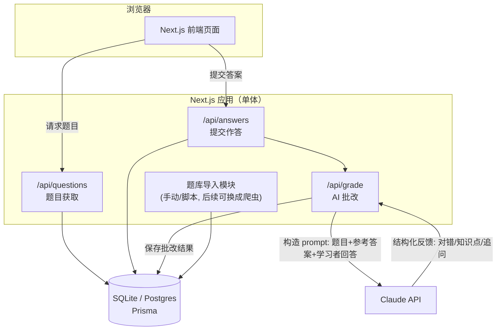
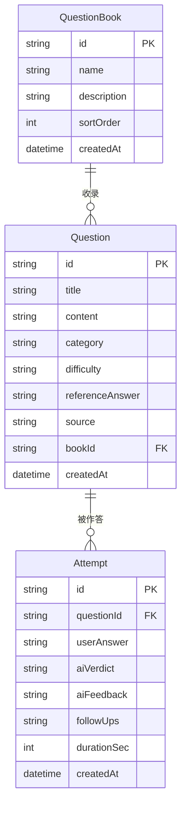

# MLE AI Booster

一个面向 AI/ML 工程师（MLE）岗位面试的刷题与 AI 陪练工具：题库来自网络爬取/整理，学习者作答后由 AI 给出批改、纠错和追问，帮助巩固面试知识点。

> 当前阶段：主界面 dashboard 已接本地 SQLite 真实数据；云端形态不连库、自动降级为只读演示。下一步是三个模块页与 AI 批改闭环。设计会随实际开发迭代更新。

## 1. 产品定位与 MVP 范围

- **目标用户**：个人 / 小范围使用（自用或分享给几个朋友），暂不做多租户、注册登录、计费等面向公开产品的能力。先把核心学习闭环做扎实，后续再评估是否要往"产品"方向扩展。
- **核心闭环**：
  1. 系统展示一道面试题（概念题 / 场景题 / 追问式题目）
  2. 学习者输入文字回答
  3. AI 对回答进行批改：指出对错、遗漏点、给出参考答案、酌情追问
  4. 学习者可以查看历史记录，追踪哪些知识点掌握得不好
- **暂不做**（留到后续阶段）：
  - 用户账号体系 / 多用户数据隔离
  - 自动化爬虫调度（题库先靠手动导入 / 人工整理的种子数据，爬虫模块预留可插拔接口，具体实现后续再设计）
  - 计费、配额限制
  - 移动端 App（先做响应式 Web）

## 2. 技术栈选型

选择 **全栈 Next.js（TypeScript）**，前后端在同一个仓库、同一套语言里完成，降低个人项目的维护成本：

| 层 | 选型 | 理由 |
|---|---|---|
| 前端 | Next.js (App Router) + React + TypeScript | SSR/CSR 混合，页面路由和 API 路由统一 |
| UI | Tailwind CSS + shadcn/ui | 组件开箱即用，样式一致性好，个人项目开发效率高 |
| 后端逻辑 | Next.js Route Handlers (`app/api/**`) | 不用单独起一个后端服务，前后端共享类型定义 |
| 数据库 | SQLite（本地开发）→ Postgres（未来部署时可平滑迁移） | 本地开发零配置；ORM 屏蔽差异，迁移成本低 |
| ORM | Prisma | schema 即文档，migration 管理清晰，TS 类型自动生成 |
| AI 能力 | Claude API（Anthropic SDK） | 用于题目批改、追问生成；后续可扩展支持切换模型 |
| 题库来源 | 手动导入 / 种子数据（JSON/CSV）+ 预留爬虫接口 | 当前不设计具体爬虫，只约定"题目导入"的数据契约，后续可插拔实现 |
| 部署 | 暂不考虑，先保证本地 `npm run dev` 跑通 | 架构上不锁死平台，Next.js 对 Vercel / 自建 Docker 都友好 |

## 3. 系统架构



**说明**：
- 目前是单体应用（Next.js 一个进程），没有拆分独立的爬虫服务/微服务，避免个人项目过度设计。
- 题库导入模块（`Ingest`）只定义数据契约（见下方数据模型），具体是"手动整理 JSON 导入"还是"写爬虫脚本"是后续可替换的实现细节。
- AI 批改被抽成独立的 API 层（`/api/grade`），方便以后替换/对比不同模型，或加缓存、限流。

## 4. 数据模型

已落到 `prisma/schema.prisma`，本地 SQLite。



- `QuestionBook`：题本，对应百词斩「单词书」的概念，一个题本收录多道题。
- `Question`：题目本体。`category`（ML 基础 / 深度学习 / LLM / 生成式 / ML 系统设计 / Coding / Behavioral）、`difficulty`（入门 / 进阶 / 困难）、`referenceAnswer`（供 AI 批改参照）、`source`（来源，便于追溯导入批次）。
- `Attempt`：每一次作答记录。`aiVerdict` 取 `correct` / `partial` / `wrong`，为空表示还没批改；`durationSec` 是本次作答耗时，用于「今日用时」统计。
- 当前不设计 `User` 表；后续要支持多用户，只需新增 `User` 并给 `Attempt` 加 `userId`。

### 两处 SQLite 限制导致的设计妥协

1. **不支持枚举** —— `category` / `difficulty` / `aiVerdict` 在库里都是 `String`。写入侧由 `lib/types.ts` 的联合类型约束；读取侧展示类型用 `string`，因为从库里读出来的值无法在类型层面保证属于联合，强行断言只会把问题藏起来。
2. **不支持标量数组** —— 原设计的 `followUps String[]` 改为存 JSON 字符串，读写统一走 `lib/db.ts` 的 `serializeFollowUps` / `parseFollowUps`。

### 统计口径

页面上的数字含义由这些定义决定，实现在 `lib/data.ts`，改动请同步改这里：

| 指标 | 口径 |
|---|---|
| 已掌握 | 该题**最近一次**作答判定为 `correct` |
| 待复习错题 | 该题**最近一次**作答判定为 `wrong` 或 `partial` |
| 连续打卡 | 从今天往前，连续每天都有作答记录的天数（今天还没答不算断签） |
| 近 30 天正确率 | 近 30 天全部作答中 `correct` 的占比；无记录时显示 `—` 而不是 0% |
| 题本进度 | 该题本中至少作答过一次的题目数 |

## 5. 目录结构

脚手架用的是 `--no-src-dir`，代码直接放在仓库根目录，不套 `src/`（Next.js 官方模板默认如此，没必要多一层）。

```
mle-ai-booster/
├── app/
│   ├── layout.tsx             # 根布局：字体、metadata
│   ├── globals.css            # 设计令牌（品牌红蓝 / 图表标记色 / 状态色）+ Tailwind
│   ├── page.tsx               # 主界面 dashboard
│   ├── books/                 # MLE 题本（阶段 1）
│   ├── wrong-answers/         # 错题库（阶段 1）
│   ├── classifier/            # MLE 题库分类器（阶段 1）
│   └── api/                   # 待做：questions / answers / grade
├── components/                # 展示组件，全部为 server component
│   ├── BrandMark.tsx          # blaugrana 竖条纹品牌标记
│   ├── ProgressRing.tsx       # 今日计划进度环（meter）
│   ├── StatTile.tsx           # KPI 小卡
│   ├── ModuleCard.tsx         # 三大入口模块卡
│   ├── MasteryBars.tsx        # 分类掌握度（单色相 meter）
│   ├── WeeklyBars.tsx         # 近 7 天刷题量（单序列柱状图）
│   ├── VerdictPill.tsx        # AI 判定状态标签
│   └── ComingSoon.tsx         # 未完成模块的占位页
├── lib/
│   ├── types.ts               # 领域类型 + 统计口径相关的展示类型
│   ├── db.ts                  # Prisma client（懒加载）+ followUps 序列化
│   ├── data.ts                # 「有库走库 / 无库降级」的唯一分叉点
│   ├── generated/prisma/      # prisma generate 产物，已 gitignore
│   └── llm.ts                 # 待做：Claude API 封装
├── prisma/
│   ├── schema.prisma
│   ├── migrations/
│   └── seed.ts                # 种子脚本，幂等
├── prisma7.config.ts          # Prisma 7 配置：schema 路径 / datasource / seed 命令
└── data/
    └── seed-questions.json    # 4 个题本 + 22 道种子题
```

### 界面设计约定

- **品牌配色红蓝**：巴萨 blaugrana（`#004D98` / `#A50044`）× 哈佛 crimson（`#A51C30`）× 浙大求是蓝（`#003F88`）。
- **模块划分参考百词斩**（题本≈单词书、错题库≈错词本、分类器≈分类浏览、今日计划≈打卡），但视觉设计不模仿。
- **两组颜色不要混用**，见 `globals.css` 顶部注释：
  - `--brand-*` 用于 UI chrome（导航、按钮、装饰条），不受图表亮度带约束；
  - `--mark-*` 用于图表标记，已通过 CVD / 亮度带 / 对比度校验（light 蓝 `#2f7fd6` vs 红 `#A50044` 的 CVD ΔE 22.3；dark 蓝 `#4a94e8` vs 红 `#e0578f` 的 ΔE 14.7）。**改动标记色前必须重跑校验**，不要凭肉眼判断。
- **状态色固定不随品牌走**（good/warning/critical），且始终「图标 + 文字」成对出现，不靠颜色单独表意。
- 图表形式按数据职责选：单个当前值用 KPI 小卡而非单柱图；比值对上限用 meter（同色系轨道 + 填充）而非饼图；同一指标跨分类比较用单一色相，不用分类色板。

## 6. 核心流程：作答 → AI 批改

1. 前端从 `/api/questions` 拉一道题（可按 `category`/`difficulty` 筛选，或随机）。
2. 学习者提交回答 → `POST /api/answers` 落库为一条 `Attempt`（此时 `aiVerdict` 为空）。
3. 服务端调用 `/api/grade`（或直接在 `answers` handler 里调用），组装 prompt：
   - 题目 + 参考答案 + 学习者回答 → 要求模型输出结构化 JSON（判定、缺漏点、纠正说明、1-2 个追问）。
   - 用结构化输出（tool use / JSON schema）保证前端能稳定渲染，而不是解析自由文本。
4. 批改结果写回 `Attempt`，前端展示反馈；学习者可选择继续回答追问，或进入下一题。
5. 历史记录页面按 `category` 聚合正确率，帮助学习者定位薄弱环节。

## 7. 题库来源（当前阶段）

- 先手动整理一批种子题目（`data/seed-questions.json`），通过一个简单的 seed 脚本导入数据库，跑通整个学习闭环。
- 预留 `src/lib/ingest/` 目录和统一的"导入一批 Question"函数签名，后续无论是写爬虫、调用第三方题库 API，还是接入 RSS/社区帖子抓取，都只需实现同一个接口，不影响上层。
- 爬虫的具体技术方案（目标网站、反爬策略、更新频率、去重）留到确定数据源之后再设计，避免过早决策。

## 8. 路线图

- **阶段 0（已完成）**：架构设计、README、技术选型确认、CI/CD、主界面 dashboard（假数据）。
- **阶段 1（进行中）**：跑通最小闭环。
  - [x] 本地 SQLite + Prisma + 种子题库（4 题本 / 22 题）
  - [x] 主界面 dashboard 接真实数据，云端降级为只读
  - [ ] 题本 / 错题库 / 分类器三个模块页
  - [ ] 答题页 + `/api/grade` AI 批改
- **阶段 2**：历史记录 / 薄弱知识点统计、更好的 prompt 设计、追问式多轮对话。
- **阶段 3（按需）**：题库自动化更新（爬虫/定时任务）、部署上线。
- **阶段 4（按需，视是否要面向他人开放）**：用户账号体系、多用户数据隔离。

## 9. 本地开发

Node 版本要求 **24.x**（见 `.nvmrc` 与 `package.json` 的 `engines.node`）。用 nvm 的话：

```bash
nvm use          # 读取 .nvmrc
npm install
npm run dev
```

三个校验命令和 CI 里跑的完全一致，提交前本地先过一遍：

```bash
npm run lint
npm run typecheck
npm run build
```

### 数据库（本地）

首次拉下仓库后需要建库并导入种子数据：

```bash
cp .env.example .env      # 或手动创建，内容见下
npm run db:migrate        # 建库 + 应用 migration
npm run db:seed           # 导入 4 个题本 + 22 道题 + 一批作答记录
```

`.env` 只需要一行（这个文件不入库）：

```env
DATABASE_URL="file:./dev.db"
```

其他命令：

| 命令 | 作用 |
|---|---|
| `npm run db:studio` | 打开 Prisma Studio 可视化查看/编辑数据 |
| `npm run db:reset` | 删库重建并重跑 seed（数据会全部丢失） |
| `npx prisma generate` | 手动重新生成 client（改完 schema 后必须跑，见下） |

### 规模上限与优化阈值（已实测，2026-09-01）

结论先说：**题库变大不需要换数据库服务器。** 在临时副本上灌到 **10 万道题 + 30 万条作答**（库文件 441 MB）实测：

| 查询 | 耗时 |
|---|---|
| 按分类取 50 道（有索引） | 2.7 ms |
| 按难度计数（有索引） | 4.6 ms |
| 最近 5 条作答（有索引） | 0.53 ms |
| 近 7 天趋势（时间范围过滤） | 4.6 ms |
| 单条作答写入 | 0.36 ms |

索引用对了，SQLite 在这个量级上是毫秒级的。灌 10 万道题耗时 8.7 秒。

**先撞墙的是应用代码，不是数据库。** 两个已知瓶颈和对应解法：

| 瓶颈 | 现状耗时（30 万作答） | 解法 | 优化后 |
|---|---|---|---|
| `lib/data.ts` 全量拉 Attempt 进内存聚合 | 681 ms | `Question` 加 `latestVerdict` 列，写入时同步维护（反规范化） | **17.8 ms（38x）** |
| 题目搜索用 `LIKE` 全表扫描 | 585 ms | SQLite 内置 FTS5 全文索引 | **0.8 ms（757x）** |

关于第一条有个反直觉的实测结果，记下来免得重走弯路：**把内存聚合改写成 SQL 聚合（自连接取 `max(createdAt)`）反而更慢（846 ms）**，加复合覆盖索引也只提速 1.2x —— 因为瓶颈是对 30 万行做 GROUP BY 本身，不是关联查找。所以正确方向是反规范化，不是「把计算下推到 SQL」。反规范化的代价是每条写入多 0.36 ms，可忽略；风险是 `latestVerdict` 与 `Attempt` 可能不同步，务必在同一个事务里更新。

FTS5 的代价是建索引 8.8 秒（一次性）+ 库大 20 MB。

**什么时候才真的需要数据库服务器 —— 触发因素是部署形态和并发，不是数据量：**

| 场景 | 需要 server 吗 |
|---|---|
| 一个人本地用，题库几十万道 | 不需要，SQLite 完全够 |
| 多人通过网络访问同一个库 | 需要。SQLite 是文件，跨机器访问依赖网络文件系统，而 NFS/SMB 的文件锁不可靠，会损坏数据库 |
| 部署到 serverless（Vercel） | 方案不成立。文件系统是临时的、多实例的，写入即丢 —— 这正是本项目选「云端不带库」的原因 |

SQLite 的硬限制是**同一时刻只允许一个写入者**（WAL 模式下为一写多读）。单人本地使用永远撞不到。

**当前阶段（22 题 / 75 条作答）不要做任何上述优化** —— 那是纯负担，还多了一致性维护成本。等 dashboard 真的变慢再动，届时已知该动哪里、能提速多少。真要换 server 时，Turso（SQLite 协议走网络，schema 几乎不用改）比 Postgres 迁移成本低。

### Prisma 7 的几个坑（与 Prisma 6 不同，踩过了记下来）

1. **npm 的 `latest` 标签指向 `8.0.0-rc.12`（一个 RC）**，稳定版在 `prev` 标签上。所以 `package.json` 里 `prisma` 和 `@prisma/client` 都用 `-E` 精确钉在 `7.10.0`，不要用 `^`，也不要跟着 CLI 的升级提示走。
2. **必须用 driver adapter** —— SQLite 走 `@prisma/adapter-better-sqlite3` + `better-sqlite3`，`new PrismaClient({ adapter })`，不再是内置引擎自己连。
3. **`prisma migrate dev` 不再自动重新生成 client** —— 改完 schema 跑完 migrate 之后，必须手动 `npx prisma generate`，否则新字段会报 `Unknown argument`。
4. **datasource 的 url 不写在 schema 里**，移到了 `prisma7.config.ts`。
5. **`tsx` 不自动加载 `.env`** —— `prisma/seed.ts` 顶部显式 `import "dotenv/config"`，这样直接 `npx tsx prisma/seed.ts` 也能跑。
6. `prisma init` 会往仓库里塞 `.agents/` `.windsurf/` `.claude/skills/` 和 `skills-lock.json`（约 445 KB 的 vendor agent 文档）。这些是工具本地产物，已加进 `.gitignore` 不入库；本地留着有用（Prisma 7 的权威用法就在里面）。

具体的环境变量（如 `ANTHROPIC_API_KEY`）会在接入 AI 批改时补充到本文档。

## 10. CI/CD

### CI（已配置并跑通）

`.github/workflows/ci.yml`，在 push / PR 到 `main` 时触发，两个并行 job：

| Job | 内容 | 作用 |
|---|---|---|
| `lint / typecheck / build` | `npm ci` → `npm run lint` → `npm run typecheck` → `npm run build` | 保证 `main` 始终可构建 |
| `dependency audit` | `npm audit --audit-level=high` | high 及以上漏洞直接红 |

几个刻意的设计：

- **Node 版本单一来源**：CI 用 `node-version-file: .nvmrc`，本地 `nvm use` 读同一个文件，Vercel 侧读 `package.json` 的 `engines.node`（Vercel 不读 `.nvmrc`）。三处都是 **24.x**。
  - 注意：Vercel 将于 **2026-10-01 弃用 Node 20**，上游 Node 20 已在 2026-04 EOL，所以这里不用 20。
- **`concurrency` + `cancel-in-progress`**：同一分支连续 push 时取消旧 run，省 Actions 额度。
- **`permissions: contents: read`**：最小权限，CI 只需要读代码。
- **缓存两层**：`setup-node` 的 npm 缓存 + `.next/cache`（Next.js 增量构建缓存）。
- **audit 单独成 job**：红的时候一眼能区分「代码问题」还是「依赖漏洞」。如果某个传递依赖长期没有修复版导致噪音，在该 step 上加 `continue-on-error: true`，不要放宽 `--audit-level`。

### 建议开启分支保护（需要你在网页上操作）

CI 现在会跑，但不会阻止把红的代码合进 `main`。GitHub → 仓库 **Settings → Rules → Rulesets → New branch ruleset**（或旧版 Settings → Branches）：

1. Target branches 选 `main`。
2. 勾 **Require status checks to pass**，把 `lint / typecheck / build` 和 `dependency audit` 加进去。
3. 勾 **Require a pull request before merging**（个人项目可不勾，想直接 push main 就留空）。

### 运行形态：本地带数据库，云端不带

当前是自研自用阶段，刻意做成**两种形态共用一份代码**，云端不连任何数据库：

| | 本地 `localhost` | 云端（Vercel） |
|---|---|---|
| 数据库 | SQLite 文件，完整读写 | **不连库** |
| 题目来源 | 数据库（由种子数据导入） | 直接读打包进 bundle 的 `data/seed-questions.json` |
| 作答记录 | 落库为 `Attempt`，可查历史 | 不落库，仅存浏览器 `localStorage`，刷新站点即失 |
| 历史统计 / 薄弱知识点 | 有 | 无（依赖 `Attempt` 表） |
| AI 批改 | 有 | 有（走 Claude API，与数据库无关） |
| 成本 | $0 | $0 |

切换开关就是 `DATABASE_URL` 这一个环境变量：**存在则走数据库，不存在则降级到只读种子数据。** 云端不配这个变量即可。分叉点只有一处 —— `lib/data.ts` 的 `getDashboardData()`。

降级模式下页面会顶一条「只读演示模式」提示，并且**所有个人进度显示为 0、正确率显示 `—`**，不拿假数字充场面。

这么做的好处：云端始终有一个能点开演示的地址，但零数据库成本、零数据合规负担（不存任何他人数据）；等真要给别人用、需要历史记录了，只要在 Vercel 加上 `DATABASE_URL`（比如 Neon 免费版）就自动升级为完整形态，代码不用改。

**由此产生三条硬约束，写代码时必须守住（否则 CI 或 Vercel 构建会红）：**

1. **构建期绝不能连数据库。** 需要数据库的页面必须标 `export const dynamic = 'force-dynamic'`，不要让它进静态预渲染。
2. **`prisma generate` 可以放进构建（它不连库）；`prisma migrate deploy` 绝不能放进 Vercel 构建。** migration 只在本地对本地库执行。
3. **Prisma client 必须懒加载**（用到时才 `new PrismaClient()`），不能在模块顶层就建连接 —— 否则云端一 import 就炸。

还有两条工程约束：

4. **`prisma generate` 必须进构建** —— `package.json` 的 `postinstall` 脚本负责。已实测：**没有 `DATABASE_URL` 时 `prisma generate` 正常成功（退出码 0）**，所以云端构建不会因此失败。生成产物 `lib/generated/prisma/` 已 gitignore。
5. **`better-sqlite3` 是原生模块，不能进云端依赖图** —— `lib/data.ts` 用**动态 import** 加载 `lib/db.ts`，只有确实要查库时才加载；云端走不到那条分支，原生模块不会被打包。

> CI 天然就是这条架构的守卫：CI 里**没有** `DATABASE_URL`，却要跑 `npm run build`。哪天有人不小心写了构建期的数据库访问，CI 立刻变红，不用等部署到 Vercel 才发现。这个保护是免费的，不需要额外配置。

**双形态已实测通过**：

| | 构建 | 运行时 |
|---|---|---|
| 有 `DATABASE_URL` | ✓ `/` 为 `ƒ (Dynamic)`，不预渲染 | ✓ 显示真实数据（连续 7 天、今日 8/12、各分类掌握度） |
| 无 `DATABASE_URL`（模拟 Vercel） | ✓ 退出码 0 | ✓ 只读横幅出现、进度全 0、打卡徽章隐藏、空态文案正确 |

### 成本：当前全链路 $0（均已核实）

| 项 | 免费额度 | 说明 |
|---|---|---|
| GitHub Actions | **public 仓库无限分钟**；private 为 2000 分钟/月 | 单次 CI 约 2 分钟，即便转 private 也远用不完 |
| Vercel Hobby | 免费，无需信用卡；100 次部署/天 | **限非商业、个人用途**（fair use）。将来要商业化需升 Pro（$20/月/席） |
| 数据库 | **$0，因为云端不连库** | 需要时再接 Neon 免费版：永久免费、不要信用卡、0.5 GB/项目、100 CU-hours/月、闲置自动 scale-to-zero |
| Claude API | 无免费额度 | 唯一真实支出，按 token 计费，与部署方案无关 |

注意：`ANTHROPIC_API_KEY` 一旦配到公开可访问的云端部署上，任何人都能通过页面消耗你的 API 额度。自用阶段建议在 Vercel 打开 **Settings → Deployment Protection → Vercel Authentication**（Hobby 计划可用），这样只有登录你 Vercel 账号的人能访问该部署。

### CD：部署到 Vercel（走官方 Git 集成，仓库内无需配置）

不需要额外写 GitHub Actions —— Vercel 的 Git 集成本身就是 CD：

1. 在 [vercel.com](https://vercel.com) 用 GitHub 账号登录，**Add New Project**，选择 `Raventhatfly/MLE-AI-Booster`。
2. Framework Preset 会自动识别为 Next.js，默认配置直接可用；Node.js Version 会被 `engines.node`（`24.x`）覆盖，无需手动改。
3. 连接后自动生效：push 到 `main` → 生产部署；其他分支 / PR → 独立的 Preview 部署链接。
4. 环境变量在 **Settings → Environment Variables** 配，**不要提交到仓库**（`.gitignore` 已排除 `.env*`）：
   - `ANTHROPIC_API_KEY` —— Claude API 密钥（阶段 1 需要）
   - `DATABASE_URL` —— **云端刻意留空**，见上方「运行形态」。将来要完整形态时才填
5. 建议同时打开 **Deployment Protection → Vercel Authentication**，见上方成本一节的说明。
6. 这一步需要你自己的 Vercel 账号授权，无法代为完成。

> Vercel 的构建独立于 GitHub Actions：CI 红了 Vercel 照样会部署。如果要「CI 通过才允许部署」，得配上面的分支保护 + 只从 PR 合并到 `main`。
